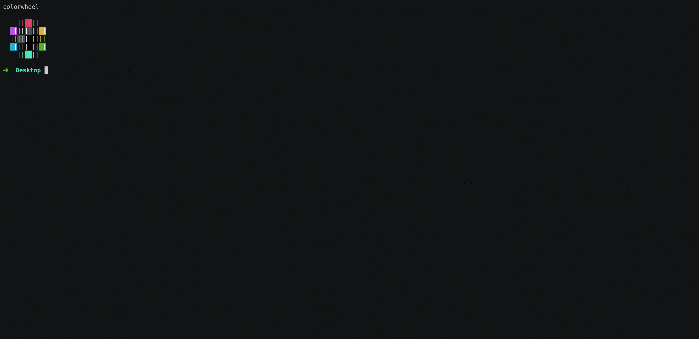
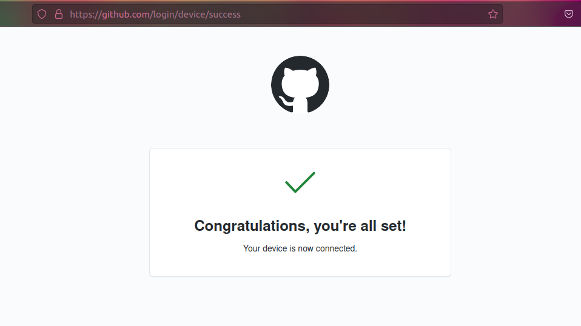
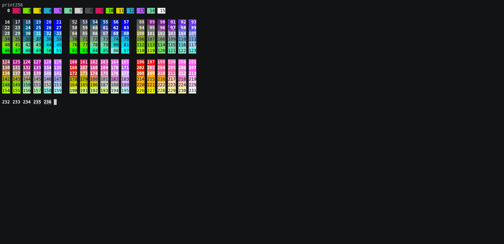
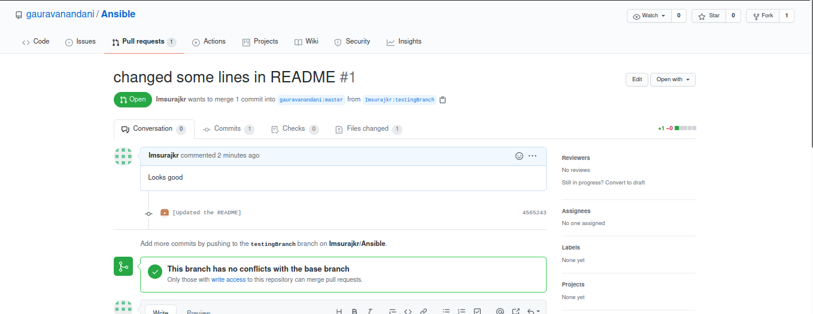

# Welcome to CleanCodeWorkshop :checkered_flag:

<span style="width:100%">[](https://forthebadge.com)
[](https://forthebadge.com)
[](https://forthebadge.com)
</span>


<span style="width:100%">[](https://forthebadge.com)
[](https://forthebadge.com)
[](https://forthebadge.com)
</span>


## About the Workshop 

* This workshop is conducted for the hands-on learning of the best Clean Coding practices.

## Agenda of the Workshop 
	
* overview and explanation
* break
* practical via gitlab code in small groups
* coming back to discuss learnings.


## Rules :boom:


### 1) Fork this repo incase facing issue follow this documentation.
### 2) Every member is assigned to a group.
### 4) There are branches based on group name. Refactor the code. 
### 5) Create a PR [ Pull Request ] for that particular branch only.
### 6) There are multiple levels in which questions are designed.


<!--  -->
<!--  -->
<!--  -->

## Github CLI 

Installing gh cli [link](https://github.com/cli/cli/blob/trunk/docs/install_linux.md)

```bash 

curl -fsSL https://cli.github.com/packages/githubcli-archive-keyring.gpg | sudo gpg --dearmor -o /usr/share/keyrings/githubcli-archive-keyring.gpg

echo "deb [arch=$(dpkg --print-architecture) signed-by=/usr/share/keyrings/githubcli-archive-keyring.gpg] https://cli.github.com/packages stable main" | sudo tee /etc/apt/sources.list.d/github-cli.list > /dev/null

sudo apt update

sudo apt install gh

gh auth login
```



```bash
# Clone the repo 
git clone https://github.com/Imsurajkr/cleancodeworkshop.git
cd cleancodeworkshop
gh repo fork 
parentBranch=GroupName # Replace Group Name with your group 
candidateName=MemberName # Replace MemberName with your Name
branchName="$parentBranch-$candidateName"
git checkout -b $branchName
# Add Your magic When done 
git pull 
git add <FilesChanged> 
git commit -m "Customized Message"
git push 
gh pr create --title "I did some changes" --body "And it works"
# All the best :-)
```

